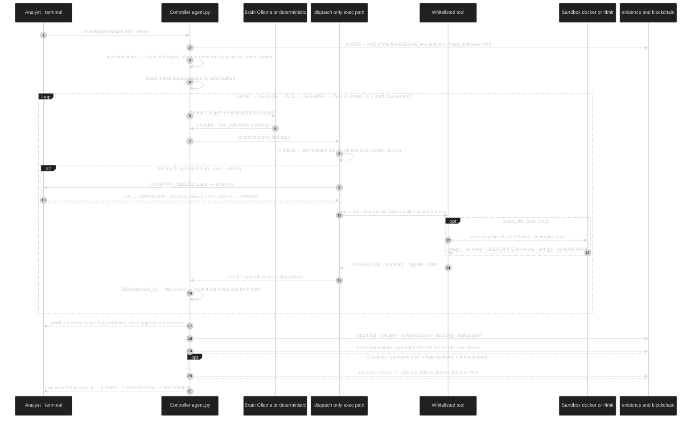

# ARCHITECTURE — module boundaries, data flow, and why each seam is where it is

SENTINEL-IR is 9 291 lines of Python in one package, a 9-module tool registry, and two
optional back-ends (Docker, JSON-RPC chain). The design goal was not "few files"; it was
**make every dangerous capability cross exactly one auditable boundary**.

## 0. Diagrams (colour-coded)

Three views of the same machine, and the colours carry meaning in all of them (the palette
matches the README hero). The editable sources live in
[`docs/diagrams/`](diagrams/) — `architecture.mmd`, `workflow.mmd`, `verdict.mmd` — and
`tests/test_docs_are_honest.py` fails if the copies below ever drift from them, so these cannot
rot into a pretty lie.

### 0.1 Architecture, by trust boundary

```mermaid
%%{init: {"theme": "dark", "flowchart": {"curve": "linear", "nodeSpacing": 45, "rankSpacing": 55}}}%%
%% SENTINEL-IR — architecture, colour-coded by trust boundary.
%% Keep this file and the copies in README.md / docs/ARCHITECTURE.md identical;
%% `tests/test_docs_are_honest.py` checks the colour legend and the node list exist.
%%
%% Colours are semantic, not decorative:
%%   red      attacker-controlled input (never trusted, never rendered unfiltered)
%%   amber    the human-in-the-loop controls (sanitise, gate)
%%   indigo   the harness — the only place anything is decided
%%   sky      the optional local model
%%   green    evidence and chain of custody
%%   violet   optional ledger mirror
%%   pink     display surfaces (can show status, can never speak for the case)
%%   grey     optional / degraded paths, drawn dashed on purpose
%%
flowchart LR
  classDef input fill:#450a0a,stroke:#f87171,color:#fecaca,stroke-width:2px
  classDef control fill:#713f12,stroke:#fbbf24,color:#fef3c7
  classDef core fill:#1e1b4b,stroke:#818cf8,color:#e0e7ff,stroke-width:2px
  classDef brain fill:#0c4a6e,stroke:#38bdf8,color:#e0f2fe
  classDef evidence fill:#052e16,stroke:#34d399,color:#d1fae5
  classDef ledger fill:#2e1065,stroke:#a78bfa,color:#ede9fe
  classDef display fill:#500724,stroke:#f472b6,color:#fce7f3
  classDef optional fill:#111827,stroke:#9ca3af,color:#e5e7eb,stroke-dasharray:5 4

  EML["suspicious .eml<br/>attacker-controlled text"]:::input
  PARSE["evidence/eml.py<br/>Received hops · SPF/DKIM/DMARC<br/>URLs · attachments · Message-ID"]:::core
  SANE["net.sanitize_untrusted()<br/>control tokens defanged, addresses redacted<br/>injection attempts recorded as a signal"]:::control
  AGENT["agent.py — the controller<br/>THINK → CHOOSE → ACT → OBSERVE<br/>max 14 steps · kill-switch 'x' armed"]:::core
  BRAIN["llm/ollama_client.py<br/>local Ollama tool-calling<br/>streams its reasoning into the UI"]:::brain
  DET["llm/deterministic.py<br/>offline planner — labelled<br/>LLM OFFLINE, never faked"]:::brain
  DISP["tools/dispatch.py — the ONLY exec path<br/>whitelist → needs → 15 s hard timeout → gate"]:::core
  TOOLS["9 whitelisted tools<br/>parse_headers · extract_urls · resolve_origin<br/>geolocate_ip · check_tor_exit · check_reputation<br/>static_file_scan · hash_evidence · redact_reply"]:::core
  GATE["human gate: CONFIRM_NEEDED<br/>type 'yes' · 120 s silence = DENY<br/>--yes/--demo auto-approve AND record it"]:::control
  SBX["sandbox/docker_runner.py<br/>--network none · read-only mount · cap-drop ALL<br/>tmpfs · pids/cpus/memory · destroyed after each run<br/>no docker → rlimit subprocess, labelled"]:::optional
  RISK["risk.py — log-odds fusion<br/>30 = SUSPICIOUS floor · 65 + 1 strong = MALICIOUS"]:::core
  EVID["evidence/ — hashed BEFORE analysis<br/>report.md · run.json · evidence.json · audit.log"]:::evidence
  CHAIN["blockchain/ — written after the verdict<br/>hash-chain (always) · Ganache mirror (optional)"]:::ledger
  UI["ui/console.py — rich Live<br/>risk + coverage bars · step table · origin honesty panel"]:::display
  PET["ui/pet.py · ui/care.py · status.py<br/>17 work-status moods · care reminders<br/>status.jsonl for external companions"]:::display
  PIXEL["tools_dev.serve_pixel<br/>opt-in 1×1 listener, loopback"]:::optional

  EML --> PARSE --> SANE --> AGENT
  AGENT <--> BRAIN
  AGENT <--> DET
  AGENT --> DISP --> TOOLS --> RISK --> AGENT
  TOOLS -. "file-touching tools only" .-> GATE
  GATE -.-> SBX
  SBX -.-> TOOLS
  RISK --> EVID --> CHAIN
  AGENT --> UI --> PET
  TOOLS -. "fallback 3d, human sends" .-> PIXEL
```

### 0.2 Workflow: one investigation, start to finish

Custody first, then the loop, then the verdict, then the ledger — and the exit code is the verdict
so the whole thing composes with `if`/`case` in a shell.



### 0.3 How a pile of signals becomes a verdict *and* a confidence

Two separate numbers, deliberately. Risk answers *how bad does this look*; confidence answers *how
much of the case did we actually get to see*. A terrifying email with no origin data is reported
loudly and with low confidence — that asymmetry is the whole honesty property.

```mermaid
%%{init: {"theme": "dark", "flowchart": {"curve": "stepAfter"}}}%%
%% SENTINEL-IR — how a number becomes a verdict, and why confidence is separate from fear.
%% Both halves are read straight out of risk.py: fuse() and confidence_score() plus the
%% caps applied in agent._finalize(). Colours: amber = the human-readable threshold,
%% red = capped/degraded path, green = clean, indigo = the maths.
%%
flowchart TD
  classDef core fill:#1e1b4b,stroke:#818cf8,color:#e0e7ff,stroke-width:2px
  classDef warn fill:#713f12,stroke:#fbbf24,color:#fef3c7
  classDef bad fill:#450a0a,stroke:#f87171,color:#fecaca
  classDef good fill:#052e16,stroke:#34d399,color:#d1fae5
  classDef dim fill:#111827,stroke:#9ca3af,color:#e5e7eb,stroke-dasharray:5 4

  SIG["RiskSignals from the tools<br/>53 weighted factors, −2.6 to 3.4 (mitigators are negative)<br/>each carries source · direction · strength · explanation"]:::core
  SIG --> FUSE["fuse() · log-odds<br/>risk = 100 · sigmoid((Σ w·s − 2.4) / 1.8)<br/>mitigation multiplies, never zeroes<br/>floor keeps 15 % of positive mass"]:::core
  FUSE --> R{"risk 0-100"}:::core
  R -- "under 30" --> SAFE["SAFE · exit 0"]:::good
  R -- "at least 30" --> SUS["SUSPICIOUS · exit 1"]:::warn
  R -- "at least 65 with NO strong indicator" --> SUS
  R -- "at least 65 AND one strong indicator" --> MAL["MALICIOUS · exit 2"]:::bad
  STRONG["strong indicator = one of 10 named factors<br/>known_malware_hash · brand_mismatch · homoglyph_domain<br/>spf_fail · dmarc_fail · av_detections · file_type_mismatch<br/>pdf_active_content · embedded_macro · credential_harvest_form<br/>with direction positive and strength at least 45"]:::dim
  MAL --- STRONG
  NOTE1["a soft-signal pile cannot reach MALICIOUS alone —<br/>crying wolf on six mediocre hints is the failure mode this guards"]:::dim
  SUS --- NOTE1

  SIG --> CONF["confidence_score() — orthogonal to scariness"]:::core
  CONF --> PARTS["0.45 · origin confidence, where origin confidence =<br/>max(geo confidence, source ceiling) × provenance<br/>resolved 1.00 · fallback 0.82 · degraded 0.68 · none 0.45<br/>+ 0.30 · evidence coverage done/8 families<br/>+ 0.25 · corroboration across tool families<br/>− 6 per timed-out tool · clamp 10 … 96"]:::core
  PARTS --> CAPS{"hard caps — lowest one wins"}:::warn
  CAPS -- "chain of custody broken" --> C35["cap 35 %"]:::bad
  CAPS -- "no usable sender IP at all" --> C58["cap 58 %"]:::warn
  CAPS -- "IP traced but not placed geographically" --> C68["cap 68 %"]:::warn
  CAPS -- "origin ceiling by source kind" --> C82["received hop 82 % · SPF client-ip 78 %<br/>phishing infrastructure 62 % · Message-ID rDNS 34 %"]:::core
  CAPS --> OUT["printed together, always:<br/>verdict · confidence % · risk/100 · gaps as unobserved"]:::good
  C35 --> OUT
  C58 --> OUT
  C68 --> OUT
  C82 --> OUT
```


```
                     ┌───────────────────────────────────────────────────────┐
                     │  cli.py  (argparse; exit code = verdict for shell use)│
                     └───────────────────────┬───────────────────────────────┘
                                             │ Agent(eml, demo, offline, …)
                     ┌───────────────────────▼───────────────────────────────┐
                     │  agent.py  — the only place that owns *state*         │
                     │  RiskState · events · gate · kill-switch · case dir   │
                     └──┬───────────────┬────────────────┬────────────────┬──┘
        ┌───────────────┘               │                │                └────────────────┐
        ▼                               ▼                ▼                                 ▼
┌───────────────┐              ┌────────────────┐ ┌──────────────┐                 ┌────────────────┐
│ llm/          │              │ tools/         │ │ ui/console.py│                 │ blockchain/    │
│ ollama_client │  actions →   │  dispatch +    │ ←─ live rows   │  payload →      │ hashchain (A)  │
│ deterministic │  ← observe   │  9 tools       │                │                 │ ganache   (B)  │
└───────────────┘              └───────┬────────┘                 │                 └────────────────┘
                                       │ only static_file_scan    │
                                       ▼                          ▼
                              ┌────────────────┐        ┌─────────────────┐
                              │ sandbox/       │        │ evidence/        │
                              │ docker_runner  │        │ eml.py  (parse)  │
                              │ scanner_script │        │ hasher.py (digest)│
                              │ local_exec_…   │        │ transcript.py     │
                              └────────────────┘        └─────────────────┘
```

Everything horizontal in that diagram is a **trust boundary**; the modules in a column
below a boundary are the ones allowed to be dangerous.

---

## 1. Layer rules (enforced, not aspirational)

| Layer | May import | May never |
|---|---|---|
| `cli.py` | `agent`, `config`, `blockchain`, `tools_dev` | know anything about risk math |
| `agent.py` | everything (it is the orchestrator) | touch attachment bytes directly |
| `llm/*` | `prompts`, `net` (sanitize), `models` | execute anything; import `tools/*` beyond the registry names |
| `tools/*` | `..base` (`ToolContext`, `register`), `..net`, `..evidence.eml`, `..models`, `..risk` | import `agent` (would cycle) or write to disk outside `case_dir` |
| `sandbox/*` | stdlib + `config` | know about verdicts or risk |
| `blockchain/*` | `evidence.hasher` (canonical JSON) | change a verdict, or run before the verdict is written |
| `evidence/*` | stdlib only (`email`, `hashlib`, `re`) | network |
| `ui/console.py` | `rich`, `safety` (tty/key input) | decide anything (display + gate input only) |
| `ui/pet.py`, `ui/care.py` | stdlib only | import `risk`, `tools`, `evidence`, `net`, `agent`, or read the email (display + wall clock only) |
| `status.py`, `petwatch.py` | stdlib; `petwatch` may read `ui/pet` + `ui/care` | become evidence: the JSONL is an advisory display, written from enums, and `petwatch` never opens a case file |

Two concrete consequences worth knowing while reading the code:

* **Tool modules import `from .base import ToolContext`, never `from . import …`.**
  `tools/__init__.py` re-exports the registry and importing every tool module; a
  tool importing the package (rather than `base`) closes a cycle that silently leaves
  `REGISTRY` empty (every run then "succeeds" with 0 tools — this bit us during the
  build, so it is documented here).
* **`config.py` is the only place a number lives.** `load_config(**overrides)`
  accepts keyword overrides so tests construct an `Agent(cfg_overrides={...})` instead
  of monkeypatching globals; the agent's own `Config` therefore never mutates
  module-level state. Secrets (`*api_key`, tokens) are redacted in `Config.as_dict()`
  so they can never leak into a report or the ledger.

---

## 2. The three "brains", and how one is chosen

`Agent._select_brain()` decides once, at start-up, and **prints the decision**:

1. `ollama:<model>` — if `http://127.0.0.1:11434/api/chat` answers and the model
   supports tool calling. `llm/ollama_client.py` sends the system prompt (verbatim from
   `prompts/agent_system_prompt.py`), the sanitized `<EMAIL_DATA>` block, and the tool
   schema; it accepts **either** native `tool_calls` or a JSON object in `content`
   (`_from_native` / `_from_json`), because small local models do both inconsistently.
2. `deterministic-engine` — `llm/deterministic.py`: a fixed but *data-driven* pipeline
   (which tool next, given what is known: no hops yet → parse; hops but no origin →
   resolve; origin → geolocate/Tor; URLs → extract; attachment + gate → scan). Same
   tools, same signals, same math — only the *choice* of next step is coded instead of
   sampled. The UI header then reads `LLM OFFLINE → deterministic engine`.
3. `--no-llm` forces (2) even when Ollama is up; `--offline` skips HTTP entirely.

The loop is `THINK → CHOOSE TOOL → ACT → OBSERVE → REPEAT` with a hard `max_agent_steps`
(default 14) and a `finalize` short-circuit. The engine can *never* skip a step the
harness deems mandatory: `plan_next()` returns the missing mandatory tools, and if the
model asks for the same tool twice the harness advances instead of looping. Refusals
(non-whitelisted name/args) do not consume a step's *evidence*, and 3 strikes mute the
LLM for the remainder of the run.

Why not just run the pipeline and skip the LLM? Because the LLM adds the parts a
pipeline cannot: reading an ambiguous body, deciding whether `corp-portal-secure.com`
is brand-spoofing or a real customer portal, writing the narrative, and — measurably —
being *refused and logged* when it tries to invent `shell`. The deterministic engine is
the floor, not the ceiling; both paths emit the same `RiskSignal` stream so a reviewer
can compare them (`verdict_author: "deterministic engine"` vs `"ollama:llama3.1:8b"` is
in every report).

---

## 3. Tool contract (`tools/base.py` + `dispatch.py`)

```python
@register(timeout_override=14.0)
@tool_meta(name="resolve_origin", parameters={…json schema…}, llm_hint="…")
def tool_resolve_origin(ctx: ToolContext, args: dict) -> ToolResult: …
```

* `ToolContext` carries: `cfg`, `case_dir`, `eml_path`, `raw_bytes`, `parsed`,
  `state` (shared blackboard: `origin`, `geolocate`, `reputation`, `attachment_files`,
  `sandbox_mode`), `evidence_hashes`, `switch` (kill event), `approved_file_tools`,
  `extra_iocs`. Tools may only write inside `case_dir`, and they may *not* mutate the
  source file (checked: the .eml is re-hashed at close-out).
* `ToolResult(tool, ok, summary, data, signals, skipped, timed_out)` — `summary` is what
  goes to the LLM/terminal, `data` is archived (truncated in `--json`, full in
  `run.json`), `signals` feed `risk.fuse()`.
* `dispatch.dispatch(ctx, name, args)` is the *only* way a tool runs. It first calls
  `validate_call()` (unknown name or unknown argument ⇒ `WhitelistViolation`), then wraps
  the call in `safety.run_with_timeout(...)` (`SAFETY #5`), polls `ctx.switch` before and
  after, and converts **every** exception into `ToolResult(ok=False, error=…)` — a crashing
  tool never aborts the investigation, it becomes an evidence gap line. Gate enforcement
  lives here too: a `@register(file_touching=True)` tool whose case has no human approval
  (`ctx.approved_file_tools is False`) is skipped with the reason recorded, and the gate
  verdict is stored on the result as `approved` (so a *denied* scan is visible evidence).
  `describe_tools()` / `ollama_tool_schemas()` generate both the prompt text and the native
  tool list from the *same* registry, so the model can never be shown a tool the dispatcher
  would refuse.
* Registry is built by import side-effects; `selftest` fails if any of the eight designed
  tools is missing and proves `shell` is refused, while
  `tests/test_whitelist_and_safety.py::test_registry_contains_exactly_the_designed_tools`
  pins the exact 9-name set — so a packaging mistake fails loudly.
* **Ordering is advisory; missing inputs are handled, not assumed away.** `dispatch()`
  *can* enforce a declared `needs=(...)` list (skipping the tool with the reason recorded —
  exercised by `test_prerequisite_ordering_is_enforced`), but deliberately **no production
  tool declares one**: every tool self-guards instead, because a free-running LLM may call
  them in any order. `check_tor_exit` returns a note when no candidate IP exists yet,
  `geolocate_ip` dedupes already-located IPs (`⊘`), and `resolve_origin._trace_urls()` parses
  `extract_url_pairs()` itself when `state["extract_urls"]` is absent. Net effect: a weird
  call order costs a lookup, never a whole fallback rung. The offline planner runs
  `extract_urls` *second* — before `resolve_origin` — because the lure-domain
  fallback (3a) needs the link set, then takes a **second pass** through
  `resolve_origin → geolocate_ip → check_reputation` now that attacker infrastructure is
  known (`llm/deterministic.PIPELINE`).


---

## 4. Risk state machine (`agent.py` + `risk.py`)

```
signals ──► fuse() ──► score 0..100 ──► classify() ──► verdict
   ▲                       │
   └── every tool appends ──┘      confidence_score(…) ──► confidence %
```

`fuse()` is log-odds, **not** a weighted sum: `100·σ((Σ wᵢ·sᵢ − 2.4)/1.8)`, with
mitigations applied multiplicatively and a floor so a clean static scan cannot launder a
phishing kit, plus a capped corroboration bonus for signals from independent families.
`classify()` additionally refuses to say `MALICIOUS` without ≥1 strong indicator.
Confidence is a weighted sum of *evidence quality*, never of scariness
(`risk.confidence_score`):

```
geo_part = max(geoloc_confidence, origin_ceiling) × provenance_factor(origin_status)
             provenance: resolved 1.00 · fallback 0.82 · degraded 0.68 · none 0.45
base     = 0.45·geo_part + 0.30·(100 × tool_coverage) + 0.25·(100 × corroboration)
             corroboration = min(1, 0.72 + 0.07·(signal_families − 1))
conf     = clamp(base − 6·timeouts, 10 … 96)          # then agent caps: no-origin ≤58,
                                                        # traced-but-unplaced ≤68, custody break ≤35
```
Details + tables: [`FORENSIC_METHODOLOGY.md`](FORENSIC_METHODOLOGY.md).

`RiskState.add_all()` (`risk.py`) re-fuses the **entire** signal list after every tool
(`self.score = fuse(self.signals)`; there is no incremental `+=`), so a mitigating
finding late in the run *can* lower an earlier conclusion — and it returns
`(delta, explanation)`, which is exactly the `▲ +12.3 pts` / `no material change` text the
UI shows per step. Nothing else in the codebase is allowed to write `score`.

---

## 5. Evidence & custody (`evidence/`)

* `eml.py` — one parser, used by every tool, so no tool re-parses (and re-decodes)
  differently. Handles folded headers, `=?…?=` encoded words, multipart nests,
  `get_all("Received")`, `client-ip=` **and** the Microsoft/Postfix
  `sender IP is 1.2.3.4` phrasing, DKIM tag lists, Message-ID hostname, Date offsets.
  Attachment payloads are base64-decoded to bytes and *staged* (0600) for the sandbox;
  they are never parsed in the main process.
* `hasher.py` — `record_hash`/`verify_recorded`/`append_audit`, writing
  `evidence.json` + `audit.log` per case; `canonical_json()` lives here because both the
  ledger and the chain digest must agree on serialization.
* `transcript.py` — `render()`/`write()`: `report.md` (human) + `run.json` (machine:
  `case`, `events`, `results`, `verdict`, `chain`, **`signals`**). The full signal ledger
  is in `run.json` on purpose, so `risk.fuse()` can be recomputed from the artifact
  without our code.

---

## 6. Sandbox boundary (`sandbox/`)

`docker_runner.py` builds a fixed argv (no shell strings, so nothing the agent says can
become a command), and the container is `--network none --read-only
--tmpfs /tmp:size=… --cap-drop ALL --security-opt no-new-privileges --memory … --cpus …
--pids-limit … -v <case_dir>:/work:ro --user <uid> --rm`. The scanner is a *separate
file* (`scanner_script.py`, stdlib only) copied into a scratch tmpfs, so the read-only
evidence mount is never the working directory. `_force_destroy()` runs even on timeout
(orphan `docker rm -f`), and `local_exec_helper.py` is the labelled fallback: `RLIMIT_AS`
/`RLIMIT_CPU`/`RLIMIT_FSIZE`, no network, same scanner. `SENTINEL_SANDBOX_REQUIRED=1`
turns "no Docker" into a hard denial instead.

---

## 7. Chain layer (`blockchain/`)

* **A (default)** `hashchain.py`: JSONL, append-only, `block_hash =
  sha256(canonical_json(header))`, `HEAD.json` pointer, `verify()` returns
  `{ok, blocks, broken_at, reasons, head_hash}`. Zero deps, ~1 ms for thousands of blocks.
* **B (optional)** `ganache_logger.py`: `ping()` → `connect()` (node-unlocked account or
  local signing with our pure-Python ECDSA/RLP) → `ensure_contract()` (cached address, or
  deploy from `artifacts/EvidenceChain.json`) → `log()` (4 static words) → read-back via
  `getEvidenceAt()`. `abi_codec.py` covers exactly the types the contract uses, unit-tested
  against hand-computed encodings; keccak comes from `pycryptodome`, never from us.
* `chain export --bundle` writes a self-describing verification bundle (payloads + ledger
  head + decoded on-chain record + the 4 steps to check it yourself) and no email content.

Latency/robustness: B runs **after** the verdict is displayed, is itself timeout-bounded,
and its failure only ever produces a report line — the evidence record remains the local
chain. That is what "blockchain is for chain-of-custody, never for detection" means in code.

---

## 8. UI (`ui/console.py`)

`rich` Live layout: header badges (`evidence`, `sha256…`, `brain=…`, `sandbox=…`), a
scrolling THINK/ACT/OBSERVE transcript with per-step `▲ +n pts`, **two live progress bars**
in the "running score" panel (risk 0–100 coloured green→yellow→orange→red, plus
evidence-coverage `done/expected` from `agent.EXPECTED_FAMILIES`), and the `[CONFIRM_NEEDED]` panel that reads `yes` from the TTY
with a timeout (no answer ⇒ DENIED). Non-TTY/`--demo` auto-approves *and records that it
did* (`gate: auto (demo/--yes)` in the report header). The kill-switch reader is a daemon
thread on the raw TTY (`tty.setraw` in a subshell-safe way): it sets `threading.Event`
and nothing else — every tool polls that event, so abort latency is bounded by the
per-tool timeout, not by the UI.

Two display surfaces hang off the same frame, both fed only by the controller:

* `ui/pet.py` — 17 named moods in a fixed 13×6 box (`thinking`, `typing`, `hunting`, `fur`,
  `bristle`, `steam`, `denied`, `waiting`, `tilt`/`hop`/`arch`, `flee`, plus the four care states).
  Transient moods decay back to `watching` after `MOOD_HOLD_S` so the cat cannot claim to still be
  thinking, while `waiting` (the open gate) and the pinned verdict mood do not, because those stay
  true. `ConsoleUI.set_mood()` is the only entry point, and the module-level UI singleton lets
  `ask_confirmation` announce that it is blocked on the human — the one moment the UI genuinely
  needs attention (`set_ui()` in `ui/console.py`, read back as `_ui_singleton`).
* `ui/care.py` — stretch/water/eyes intervals and an optional Pomodoro, computed from an injectable
  monotonic clock (`now=`), so it is testable without sleeping and cannot hang a run. The clock
  fires at most once per interval per reminder and writes to `audit.log`, never into the transcript.

Both are fed from exactly one place in `agent.py` (`_react()`), which passes enums and numbers.
`status.py` mirrors the same calls into JSONL for external companions; its `note` field is
vocabulary-checked (`NOTE_VOCAB`) and the `case` field is a digest, because the sink may sit in a
shared directory. `petwatch.py` is the reader (`sentinel-ir pet`) and drops any mood outside the
vocabulary, so a line written by someone else cannot invent a reaction.

---

## 9. Extension points (the honest kind)

* **New tool**: add `tools/foo.py` with `@register` + `@tool_meta`, append `"foo"` to
  `agent.EXPECTED_FAMILIES` (drives the coverage term of confidence) and
  `llm/deterministic.next_action()` (drives the offline pipeline order) if it should be
  mandatory, then add any new factors to `risk.FACTOR_WEIGHTS`. It appears automatically
  in both the LLM schema and the prompt; `selftest` fails if any of the eight designed tools is
  missing and proves a non-whitelisted name is refused, so a half-registered tool errors loudly
  instead of silently never running. `tests/test_whitelist_and_safety.py` pins the registry to
  exactly the designed set (which is how `redact_reply` had to be added to the test as well as
  the code).
* **New GeoIP/reputation source**: one function in `net.py` returning the normalized dict;
  consensus math is unchanged, disagreement handling is automatic.
* **Another chain**: implement `log(payload, …) -> TxReceipt` + `fetch_record(seq)`; the
  agent only consumes `{ok, tx_hash, seq, contract, error, note}`.

Deliberately **not** pluggable: an "execute attachment" tool, a dashboard, a cloud LLM
provider, and a "trust me" mode that skips the gate. Those are the four things that would
turn this from a tool into a liability.
